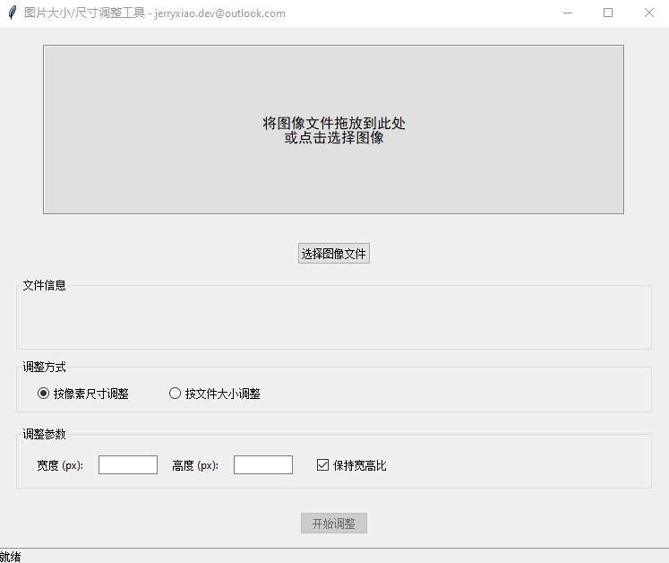

# 🖼️ Photo Size Tools

一个基于 Python 的图像大小与尺寸调整工具，支持 **按像素或目标文件大小调整**。  
轻量易用，适合摄影、设计、自媒体等需要快速压缩图片的用户。</br>

---

## ✨ 功能特性


- ✅ 两种调整方式：
  - 按像素尺寸（保持宽高比）
  - 按文件大小（自动迭代质量与尺寸，精准控制目标大小）
- ✅ 自动计算合理目标大小（默认建议当前文件的 70%）
- ✅ 支持常见图片格式：`JPG / PNG / BMP / GIF / TIFF`
- ✅ 兼容透明图像与比例锁定
- ✅ 可设置文件大小容差范围（默认 ±20%）


---

## 🧰 环境依赖

确保你的系统安装以下依赖：

```bash
pip install pillow tkinterdnd2
```

> 注：Tkinter 通常随 Python 自带，如缺失可参考操作系统文档安装。

---

## 🚀 使用方法

### 方式一：直接运行脚本
```bash
python photo_size_tools.py
```

### 方式二：双击运行（Windows）
如果系统已关联 `.py` 文件，可直接双击运行。

运行后：
1. 将图像拖入界面或点击“选择图像文件”；
2. 在“调整方式”中选择“按像素尺寸”或“按文件大小”；
3. 输入目标参数；
4. 点击“开始调整”，等待完成提示。

---

